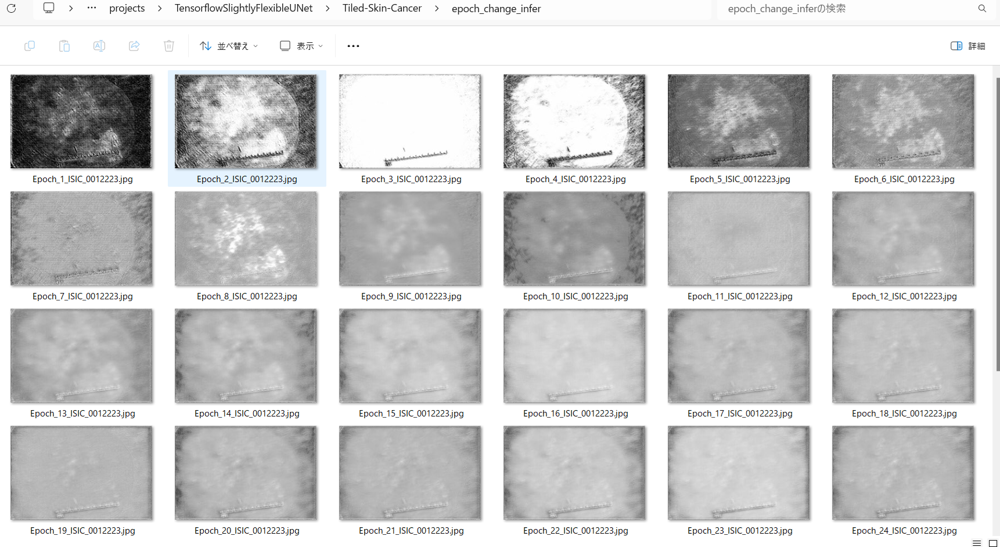
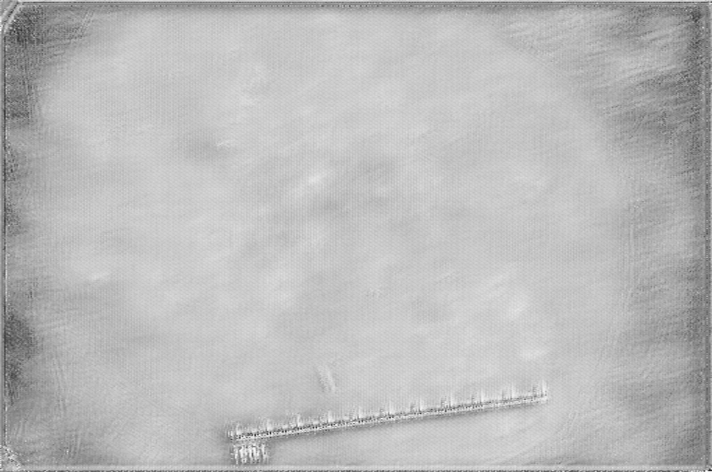
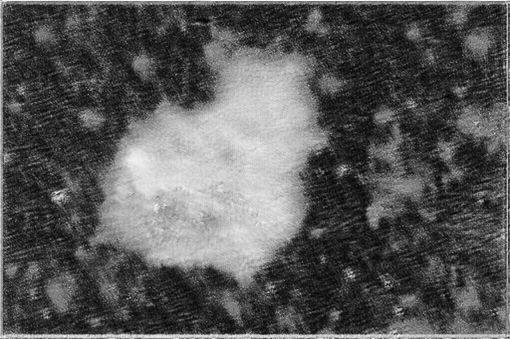
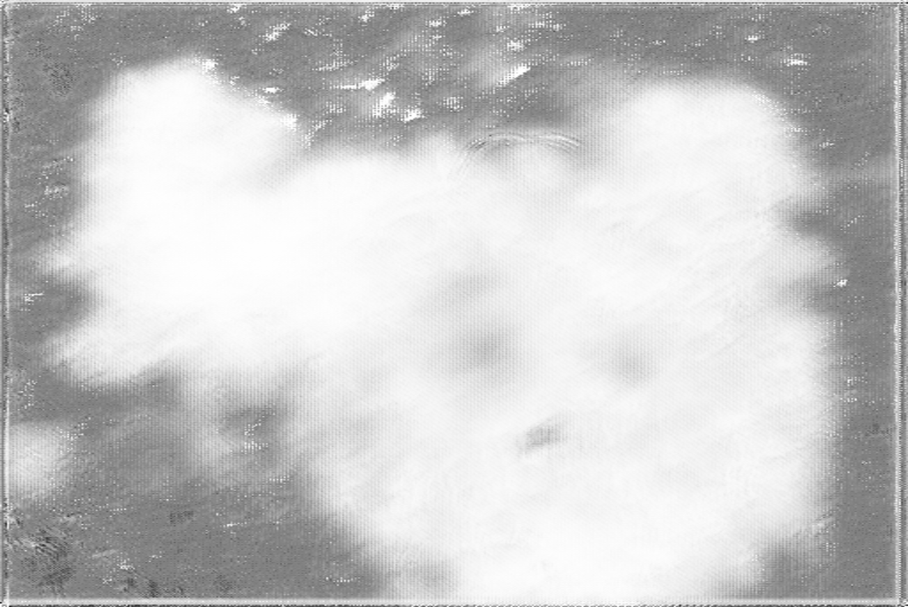
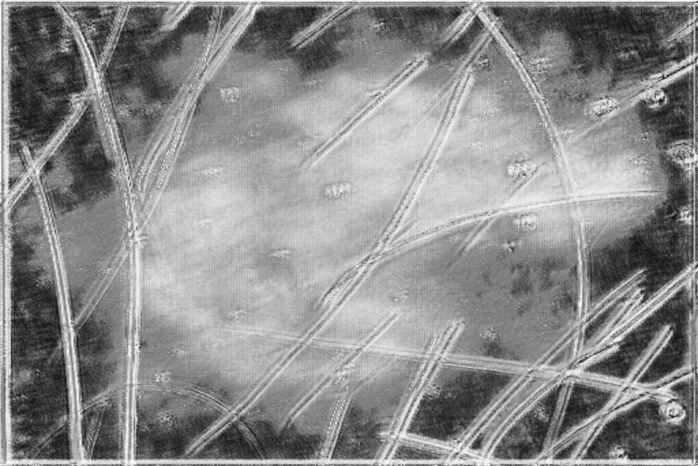
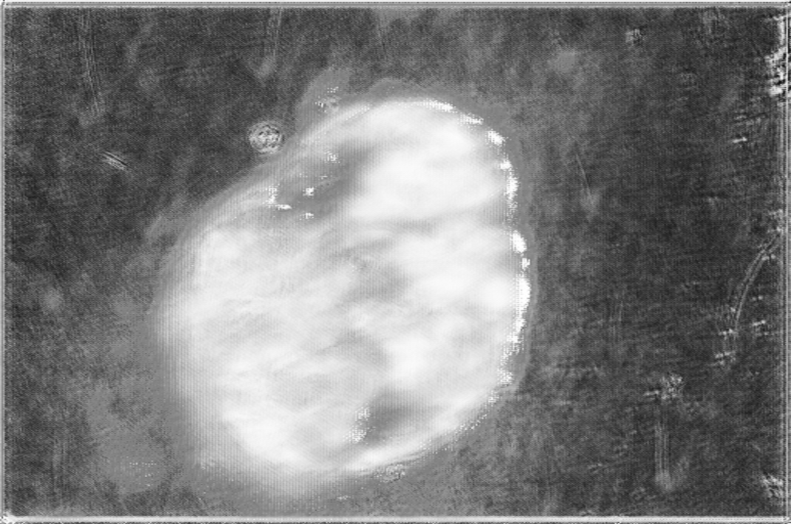

<h2>Tensorflow-Tiled-Image-Segmentation-Skin-Cancer (2024/06/04)</h2>

This is an experimental Tiled Image Segmentation project for Skin-Cancer based on
the <a href="https://github.com/sarah-antillia/Tensorflow-Image-Segmentation-API">Tensorflow-Image-Segmentation-API</a>, and
<a href="https://drive.google.com/file/d/1XKNJOfi2_n8ldmtgT_NIex4d0PTq92PR/view">
 Tiled-Skin-Cancer-ImageMask-Dataset-X.zip</a> 
 

We have already applied the Tiled Image Segmentation strategy to some UNet Image Segmentation Models. 

<li> <a href="https://github.com/sarah-antillia/Tensorflow-Image-Segmentation-API"> MultipleMyeloma </a></li>
<li> <a href="https://github.com/sarah-antillia/Tensorflow-Tiled-Image-Segmentation-Oral-Cancer">Oral-Cancer</a></li>
<li> <a href="https://github.com/sarah-antillia/Tensorflow-Tiled-ImageMask-Segmentation-Oral-Cancer">Oral-Cancer based on Tiledly-Splitted 
ImageMask-Dataset</a></li>
  
This is the fourth example to apply the strategy to a segmentation model for Skin-Cancer.

As mentioned in <a href="https://github.com/sarah-antillia/Tiled-ImageMask-Dataset-Skin-Cancer">Tiled-ImageMask-Dataset-Skin-Cancer</a>, the pixel-size of the original images and masks in validation and test dataset of 
ISIC Challenge Datasets 2017
<a href="https://challenge.isic-archive.com/data/">ISIC Challenge Datasets 2017</a> is very large from 1K to 6K, which is too large to use for a training of an ordinary segmentation model. 
Therefore, Tiled-Image-Segmentation method may be effective to infer the skin cancer regions for the large images. 
  
In this experiment, we employed the following strategy: 
<b>
 
1. We trained and validated a TensorFlow UNet model using the Tiled-Skin-Cancer-ImageMask-Dataset, which was tiledly-split to 512x512 pixels. 
2. We applied the Tiled-Image Segmentation inference method to predict the segmentation regions for a test image 
with a resolution of 4K or 6K pixels. 
  
</b>  
 Please note that <a href="https://drive.google.com/file/d/1XKNJOfi2_n8ldmtgT_NIex4d0PTq92PR/view">
 Tiled-Skin-Cancer-ImageMask-Dataset-X.zip</a> contains two type of image and mask:
   
1. Tiledly-split to 512x512 image and mask  files. 
2. Size-reduced to 512x512 image and mask files. 

Namely, this is a mixed set of Tiled and Non-Tiled ImageMask Datasets. 

Actual Tiled Image Segmentation for the images of 4K pixels. 
<table>
<tr>
<th>Input: image</th>
<th>Mask (ground_truth)</th>
<th>Prediction: tiled_inferred_mask</th>
</tr>
<tr>
<td width="330" ></td>

<td width="330" ></td>
<!--
<td></td>
 -->
<td width="330"></td>
</tr>
<tr>
<td width="330" ></td>

<td width="330" ></td>
<!--
<td></td>
 -->
<td width="330"></td>
</tr>
</table>

 
In this experiment, we have used the simple UNet Model 
<a href="./src/TensorflowUNet.py">TensorflowSlightlyFlexibleUNet</a> for this Skin Cancer Segmentation. 
As shown in <a href="https://github.com/sarah-antillia/Tensorflow-Image-Segmentation-API">Tensorflow-Image-Segmentation-API</a>.
you may try other Tensorflow UNet Models: 

<li><a href="./src/TensorflowSwinUNet.py">TensorflowSwinUNet.py</a></li>
<li><a href="./src/TensorflowMultiResUNet.py">TensorflowMultiResUNet.py</a></li>
<li><a href="./src/TensorflowAttentionUNet.py">TensorflowAttentionUNet.py</a></li>
<li><a href="./src/TensorflowEfficientUNet.py">TensorflowEfficientUNet.py</a></li>
<li><a href="./src/TensorflowUNet3Plus.py">TensorflowUNet3Plus.py</a></li>
<li><a href="./src/TensorflowDeepLabV3Plus.py">TensorflowDeepLabV3Plus.py</a></li>

 

<h3>1. Dataset Citation</h3>
The image dataset used here has been taken from the following web site. 
<pre>
ISIC Challenge Datasets 2017
https://challenge.isic-archive.com/data/
</pre>

<b>Citing 2017 datasets:</b>
<pre>
Codella N, Gutman D, Celebi ME, Helba B, Marchetti MA, Dusza S, Kalloo A, Liopyris K, Mishra N, Kittler H, Halpern A.
 "Skin Lesion Analysis Toward Melanoma Detection: A Challenge at the 2017 International Symposium on Biomedical Imaging (ISBI),
  Hosted by the International Skin Imaging Collaboration (ISIC)". arXiv: 1710.05006 [cs.CV]
</pre>
<b>License: CC-0</b> 
 
See also: 

<a href="https://paperswithcode.com/dataset/isic-2017-task-1">ISIC 2017 Task 1</a> 
<pre>
Introduced by Codella et al. in Skin Lesion Analysis Toward Melanoma Detection: 
A Challenge at the 2017 International Symposium on Biomedical Imaging (ISBI), 
Hosted by the International Skin Imaging Collaboration (ISIC)
</pre>
<pre>
The ISIC 2017 dataset was published by the International Skin Imaging Collaboration (ISIC) as a large-scale dataset 
of dermoscopy images. The Task 1 challenge dataset for lesion segmentation contains 2,000 images for training with 
ground truth segmentations (2000 binary mask images).
</pre>
 

 

<h3>
<a id="2">
2 Skin Cancer ImageMask Dataset
</a>
</h3>
 If you would like to train this Skin-Cancer Segmentation model by yourself,
 please download the dataset from the google drive 
<a href="https://drive.google.com/file/d/1XKNJOfi2_n8ldmtgT_NIex4d0PTq92PR/view">
 Tiled-Skin-Cancer-ImageMask-Dataset-X.zip</a> 
 

 
Please expand the downloaded ImageMaskDataset and place them under <b>./dataset</b> folder to be

<pre>
./dataset
└─Skin-Cancer
    ├─test
    │  ├─images
    │  └─masks
    ├─train
    │  ├─images
    │  └─masks
    └─valid
        ├─images
        └─masks
</pre>
 
<b>Tiled-Skin Cancer Dataset Statistics</b> 
 
 
As shown above, the number of images of train and valid dataset is not necessarily large. Therefore, an online dataset augmentation 
strategy to train this Skin-Cancer model may be effective to get a better trained model.  
 

 
<b>Train_images_sample</b> 

 
<b>Train_masks_sample</b> 

 

<h3>
4 Train TensorflowUNet Model
</h3>
 We have trained Skin-Cancer TensorflowUNet Model by using the following
<a href="./projects/TensorflowSlightlyFlexibleUNet/Tiled-Skin-Cancer/train_eval_infer.config"> <b>train_eval_infer.config</b></a> file.  
, in which <b>generator</b> parameter setting in [model] section is <b>True</b> which enables to train TensorflowUNet model by the
online augmentor <a href="./src/ImageMaskAugmentor.py">ImageMaskAugmentor</a>.
 
<pre>
[model]
generator     = True
</pre>
 
Please move to ./projects/Skin-Cancer and run the following bat file. 
<pre>
>1.train.bat
</pre>
, which simply runs the following command. 
<pre>
>python ../../../src/TensorflowUNetTrainer.py ./train_eval_infer.config
</pre>
<pre>
; train_eval_infer.config
; 2024/06/03 (C) antillia.com

[model]
model          = "TensorflowUNet"
generator      = True
image_width    = 512
image_height   = 512
image_channels = 3
input_normalize= False

num_classes    = 1
base_filters   = 16
;base_kernels   = (7,7)
base_kernels   = (5,5)

num_layers     = 8
dropout_rate   = 0.05
learning_rate  = 0.00004
clipvalue      = 0.5
;dilation       = (2,2)
dilation       = (1,1)

loss           = "bce_dice_loss"
metrics        = ["binary_accuracy"]
show_summary   = False

[dataset]
;Please specify a class name of your ImageDataset.
datasetclass   = "BaseImageMaskDataset"
color_order    = "bgr"

[train]
epochs         = 20
batch_size     = 2
steps_per_epoch  = 200
validation_steps = 100
patience       = 10
;metrics       = ["iou_coef", "val_iou_coef"]
metrics        = ["binary_accuracy", "val_binary_accuracy"]
model_dir      = "./models"
eval_dir       = "./eval"
image_datapath = "../../../dataset/Tiled-Skin-Cancer/train/images/"
mask_datapath  = "../../../dataset/Tiled-Skin-Cancer/train/masks/"
create_backup  = False

learning_rate_reducer = True
reducer_patience      = 4
save_weights_only     = True

;Inference execution flag on epoch_changed
epoch_change_infer     = True

; Output dir to save the infered masks on epoch_changed
epoch_change_infer_dir =  "./epoch_change_infer"

;Tiled-inference execution flag on epoch_changed
epoch_change_tiledinfer     = True

; Output dir to save the tiled-infered masks on epoch_changed
epoch_change_tiledinfer_dir =  "./epoch_change_tiledinfer"

; The number of the images to be inferred on epoch_changed.
num_infer_images       = 1

[eval]
image_datapath = "../../../dataset/Tiled-Skin-Cancer/valid/images/"
mask_datapath  = "../../../dataset/Tiled-Skin-Cancer/valid/masks/"

[test] 
image_datapath = "../../../dataset/Tiled-Skin-Cancer/test/images/"
mask_datapath  = "../../../dataset/Tiled-Skin-Cancer/test/masks/"

[infer] 
images_dir    = "./mini_test/images/"
output_dir    = "./mini_test_output"
;merged_dir    = "./mini_test_output_merged"

[tiledinfer] 
overlapping = 128
images_dir    = "./mini_test/images/"
output_dir    = "./tiled_mini_test_output"
;merged_dir    = "./tiled_mini_test_output_merged"
bitwise_blending = False
;binarize      = True
;threshold  = 127

[segmentation]
colorize   = False
black      = "black"
white      = "green"
blursize   = None

[mask]
blur       = False
binarize   = True
threshold  = 127

[generator]
debug         = False
augmentation  = True

[augmentor]
vflip    = True
hflip    = True
rotation = True
angles   = [90, 180, 270]
shrinks  = [0.8]
shears   = [0.1]

deformation = True
distortion  = True

[deformation]
alpah    = 1300
sigmoid  = 8

[distortion]
gaussian_filter_rsigma= 40
gaussian_filter_sigma = 0.5
distortions           = [0.03,]
</pre>

In this configuration file above, we added the following parameters to enable <b>epoch_change_infer</b> and 
<b>epoch_change_tiledinfer</b> callbacks in [train] section. 
We added the following Python scripts to this repository for the epoch change inferences: 
<li> <a href="./src/EpochChangeInferencer.py">EpochChangeInferencer.py</a> </li>
<li> <a href="./src/EpochChangeTiledInferencer.py">EpochChangeTiledInferencer.py</a> </li>
 
By using these callbacks, on every epoch_change, the inference and tile-inference procedures can be called
 for an image in <b>mini_test</b> folder.  
<b>Epoch_change_inference</b> 
 
<b>Epoch_change_tiled-inference</b> 
 
 
These inferred masks on_epch_change will be helpful to examine the parameters for training. 
   
The training process has stopped at epoch 20.  
 
 
 
<a href="./projects/TensorflowSlightlyFlexibleUNet/Tiled-Skin-Cancer/eval/train_metrics.csv">train_metrics.csv</a> 
 

 
<a href="./projects/TensorflowSlightlyFlexibleUNet/Tiled-Skin-Cancer/eval/train_losses.csv">train_losses.csv</a> 
 

 

<h3>
5 Evaluation
</h3>
Please move to a <b>./projects/TensorflowSlightlyFlexibleUNet/Skin-Cancer</b> folder, 
and run the following bat file to evaluate TensorflowUNet model for Skin-Cancer. 
<pre>
./2.evaluate.bat
</pre>
<pre>
python ../../../src/TensorflowUNetEvaluator.py ./train_eval_infer_aug.config
</pre>
Evaluation console output: 

  
<a href="./projects/TensorflowSlightlyFlexibleUNet/Tiled-Skin-Cancer/evaluation.csv">evaluation.csv</a> 
The loss (bce_dice_loss) and accuracy for this test dataset are very bad as shown below. 
<pre>
loss,0.8785
binary_accuracy,0.7546
</pre>

<h3>
6 Inference
</h3>
Please move to a <b>./projects/TensorflowSlightlyFlexibleUNet/Skin-Cancer</b> folder 
,and run the following bat file to infer segmentation regions for images by the Trained-TensorflowUNet model for Skin-Cancer. 
<pre>
./3.infer.bat
</pre>
<pre>
python ../../../src/TensorflowUNetInferencer.py ./train_eval_infer_aug.config
</pre>
mini_test_images 
 
mini_test_mask(ground_truth) 
 

Inferred test masks 
 
 

<h3>
7 Tiled Inference
</h3>
Please move to a <b>./projects/TensorflowSlightlyFlexibleUNet/Skin-Cancer</b> folder 
,and run the following bat file to infer segmentation regions for images by the Trained-TensorflowUNet model for Skin-Cancer. 
<pre>
./4.infer_tiles.bat
</pre>
<pre>
python ../../../src/TensorflowUNetTiledInferencer.py ./train_eval_infer_aug.config
</pre>

 
Tiled inferred test masks 
 
 

<b>Enlarged Masks Comparison</b> 
As shown below, the tiled-inferred-masks seem to be slightly clear than non-tiled-inferred-masks. 

<table>
<tr>
<th>Mask (ground_truth)</th>
<th>Non-tiled-inferred-mask</th>
<th>Tiled-inferred-mask</th>
</tr>

<tr>
<td></td>
<td></td>
<td></td>
</tr>

<tr>
<td></td>
<td></td>
<td></td>
</tr>

<tr>
<td></td>
<td></td>
<td></td>
</tr>

<tr>
<td></td>
<td></td>
<td></td>
</tr>

<tr>
<td></td>
<td></td>
<td></td>
</tr>
</table>
 
 
As shown below, the tiled-inferred-mask contains more detailed pixel level information than the non-tiled-inferred-mask. 
 
<table>
<tr>
<th>Non-tiled-inferred-mask</th>
<th>Tiled-inferred-mask</th>
</tr>
<tr>
<td></td>
<td></td>
</tr>
</table>
 
 

 
<h3>
References
</h3>
<b>1. ISIC 2017 - Skin Lesion Analysis Towards Melanoma Detection</b> 
Matt Berseth 
<pre>
https://arxiv.org/ftp/arxiv/papers/1703/1703.00523.pdf
</pre>

<b>2. ISIC Challenge Datasets 2017</b> 
<pre>
https://challenge.isic-archive.com/data/
</pre>

<b>3. Skin Lesion Segmentation Using Deep Learning with Auxiliary Task</b> 
Lina LiuORCID,Ying Y. Tsui andMrinal Mandal 
<pre>
https://www.mdpi.com/2313-433X/7/4/67
</pre>

<b>4. Skin Lesion Segmentation from Dermoscopic Images Using Convolutional Neural Network</b> 
Kashan Zafar, Syed Omer Gilani, Asim Waris, Ali Ahmed, Mohsin Jamil,  
Muhammad Nasir Khan and Amer Sohail Kashif 
<pre>
https://www.mdpi.com/1424-8220/20/6/1601
</pre>

<b>5. Image-Segmentation-Skin-Lesion</b> 
Toshiyuki Arai @antillia.com
<pre>
https://github.com/sarah-antillia/Image-Segmentation-Skin-Lesion
</pre>

<b>6. Tiled-ImageMask-Dataset-Skin-Cancer</b> 
Toshiyuki Arai @antillia.com
<pre>
https://github.com/sarah-antillia/Tiled-ImageMask-Dataset-Skin-Cancer
</pre>
